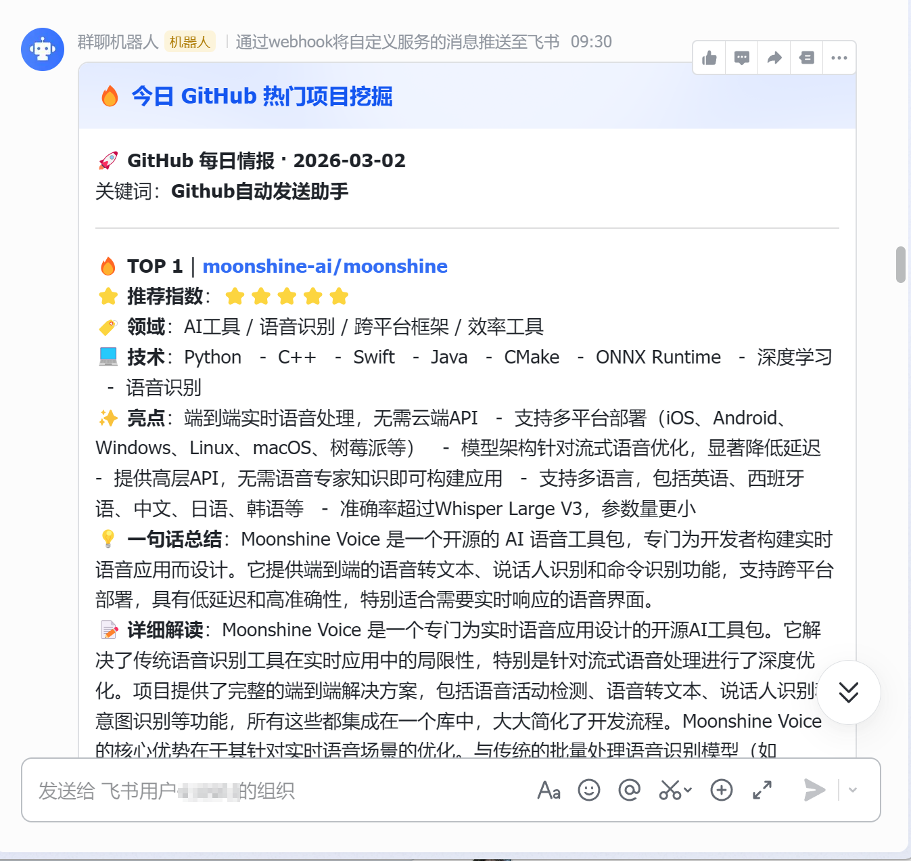
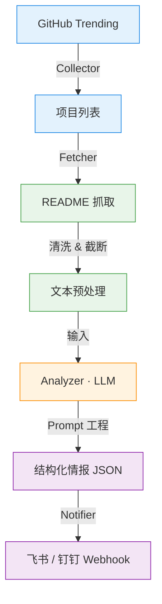
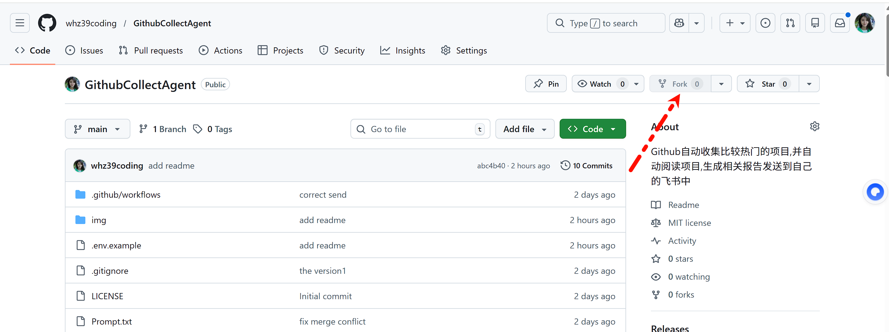
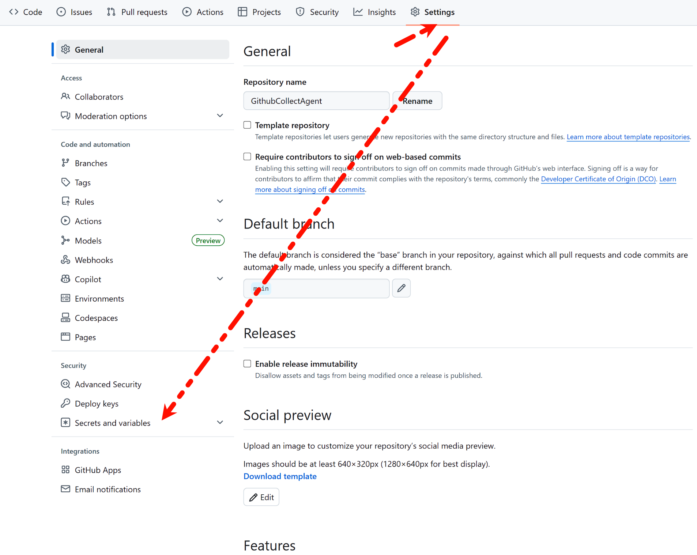
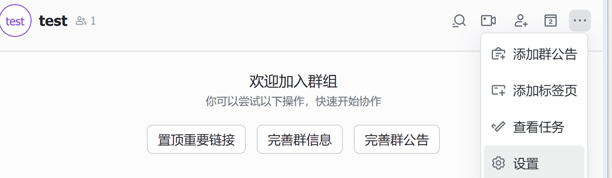
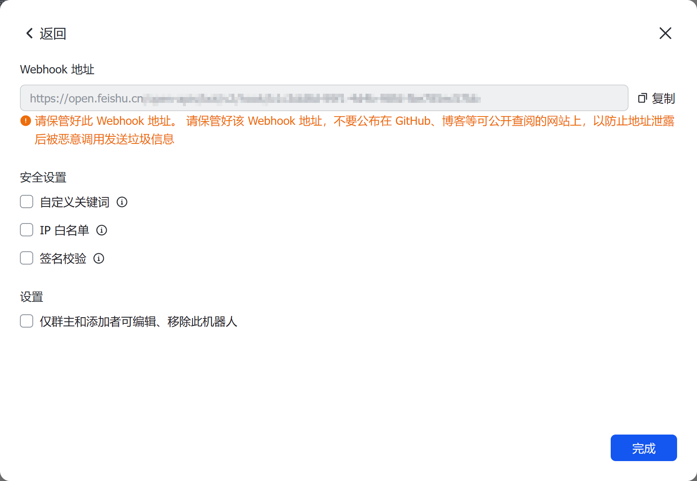
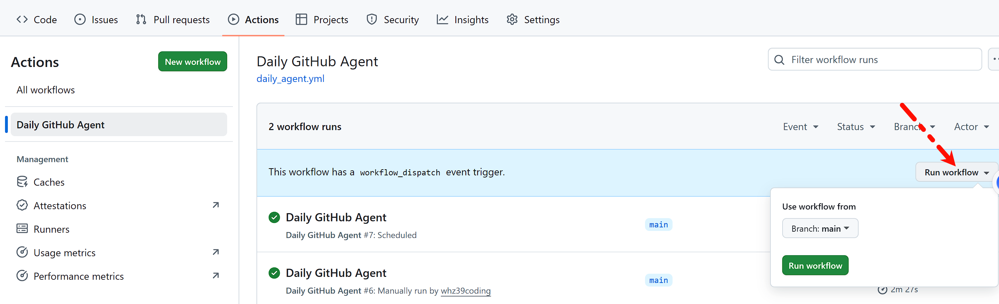

<div align="center">
  <h1>🤖 GitHub Insight Agent</h1>

  <p>
    <b>基于 LLM 的 GitHub 趋势智能分析员</b>
  </p>
  <p>
    <!-- 这里的徽章是动态生成的，看起来很专业 -->
    <a href="https://github.com/whz39coding/GithubCollectAgent/actions">
      
    </a>
    
    
    
  </p>


  <p>
     •<a href="#-简介-introduction">简介</a> •
     <a href="#-效果展示-demo">效果展示</a> •
     <a href="#bushu">自动化部署</a> •
    <a href="#-功能特性-features">功能特性</a> •    
  </p>
</div>

## 📖 简介 (Introduction)

**你是否还在每天漫无目的地刷 GitHub Trending？或者是 忙于其他工作导致错过了一些好的Github项目而感到可惜？**

**GitHub Insight Agent** 是一个全自动化的开源情报探员。它不仅能帮你把每天最火的开源项目爬取下来，还能利用 **LLM (大语言模型)** 阅读冗长的 README 文档，提取核心价值，无需你登录到Github上自己去阅读那冗长的README文件了。甚至根据设置的Prompt还可以让大模型具有**举一反三**的能力(也可自定义模型的能力修改Prompt文件即可)，为你提供基于该项目的 **商业灵感** 或 **进一步开发思路**,深刻洞察每一个的项目的进一步开发价值。此外本项目开考虑到远程调度模型的`Token`消耗,可自定义分析的长度.用最少得钱干最重要的活😘.

而且还可以根据项目的[自动化部署教程](#bushu),**无需服务器**,利用Github上的静态文件托管服务，实现**零成本**的**自动化**推送。最后一份排版精美的日报or周报会准时的 **自动** 推送到你的 **飞书 / 钉钉 / 微信**。如果觉得不错的话,留下一个宝贵的Star吧.这对我很重要.谢谢谢谢谢了❤️❤️❤️❤️❤️.有什么问题尽管提出来,也欢迎各位佬佬们开发进一步的功能.

## 📸 效果展示 (Demo)

根据本项目教程部署成功后,你将会拥有一个每天or每周根据提示词进行智能分析热门Github项目,之后把分析结果发送给你的Agent.

> *下图为飞书机器人接收到的推送消息示例：*



## ✨ 功能特性 (Features)

- 🕵️ **全自动情报搜集**：可以根据自己的爱好设置**筛选条件,发送时间**定时抓取 GitHub Trending (Daily/Weekly) 榜单。
- 🧠 **深度 AI 分析**：依据本项目提供的Prompt文件模型具有一下功能
  - 拒绝简单的翻译，AI 会深度阅读 README。
  - **核心亮点提取**：一针见血地指出项目解决了什么痛点。
  - **举一反三**：AI 会化身产品经理，基于该项目提出 2-3 个具体的应用场景或赚钱思路。
- 📦 **智能素材获取**：自动清洗 README 中的干扰信息，节省 Token 成本。
- 🚀 **多渠道推送**：支持飞书 (Feishu)、Webhook 机器人，消息卡片精美易读。
- ☁️ **零成本部署**：完全基于 GitHub Actions 运行，无需购买 VPS 服务器。


## 🛠 技术架构 (Architecture)


🔍 数据采集: 从 GitHub Trending 获取热门项目列表
📥 内容获取: 自动抓取项目 README 文件,为后续节约模型token消耗,支持截取读取内容.
🧠 AI 分析: 使用配置的 LLM 深度理解项目内容,提取核心功能和特色
📊 结构化输出: 生成标准化的 JSON 格式报告,包含项目亮点和应用建议
📤 消息推送: 可以**fork**本仓库到**你的Github仓库中**,之后设置Github Action工作流,**无需服务器**,可以实现自动的通过 Webhook 发送到飞书/钉钉,这样就可以及时的自动获取Github上的热门项目,格式化为美观的消息卡片.


## <a id="bushu">☁️ 自动化部署 (GitHub Actions)</a>

本项目内置了 GitHub Actions 工作流，可以每天定时运行。

1.  **Fork 本仓库** 到你的 GitHub 账号。



2.  进入仓库的 **Settings** -> **Secrets and variables** -> **Actions**。



3. 点击 **New repository secret**，依次添加 `.env` 中的所有变量

   

   - `LLM_API_KEY`
   - `LLM_BASE_URL`
   - `LLM_MODEL`
   - `NOTIFIER_WEBHOOK`
   - `GITHUB_TOKEN`

   其中`NTIFITER_WEBHOOK`的获取方式如下:

首先下载飞书[电脑版](https://www.feishu.cn/download)到本地.之后创建一个自己账户即可.之后点击左上角的加号“创建群组”,之后点击右上角的三个点进行设置:


再点击添加机器人,选择“自定义机器人”即可.改一下名字和描述也行,之后点击“添加”即可.你就会得到下面的界面:

得到自己的这个链接,复制添加到原来的`.env`文件就行.之后最重要的是,**要勾选自定义关键词**.之后**一定一定要填写为**:

**Github自动发送助手**.

不然有人会恶意的攻击,或者乱发等等,如果要改关键词的话,可以尝试修改`parse_result.py`文件中的`msg`的构造部分.以支持自定义关键词.


4. 返回自己项目的主页,点击菜单栏中的 **Actions** ，启用 Workflow。可以点击`Run workflow`测试一下你的环境变量是不是配置成功,以保证你的Agent可以定时运行.



如果要规定发送时间的话还可以修改`.github/workflows/daily_agent.yml`文件进行设置规定的时间修改.

## 📂 项目结构

```text
.
├── .github/workflows/   # GitHub Actions 配置
├── Prompt.txt           # AI 提示词 (Prompt Engineering)
├── analysis_readme.py   # AI 分析模块
├── collect.py           # 爬虫模块
├── fetch_readme.py      # 获取项目的readme模块
├── parse_result.py      # 消息发送模块
├── main.py              # 程序入口
└── requirements.txt     # 依赖列表
```

## 🤝 贡献 (Contributing)

非常欢迎提交 Issue 或 Pull Request！
如果你有更好的 **Prompt** 调优思路，或者想增加新的通知渠道（如微信、Telegram），请随时提交代码。

## 📄 许可证 (License)

[MIT License](LICENSE)

