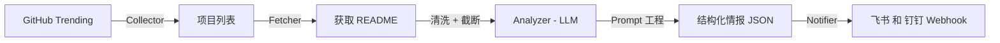

<div align="center">
  <!-- 如果你有Logo，可以把 src 换成你的 Logo 地址，没有就用 Emoji -->
  <h1>🤖 GitHub Insight Agent</h1>

  <p>
    <b>基于 LLM 的 GitHub 趋势智能分析员</b>
  </p>
  <p>
    <!-- 这里的徽章是动态生成的，看起来很专业 -->
    <a href="https://github.com/whz39coding/GithubCollectAgent/actions">
      
    </a>
    
    
    
  </p>


  <p>
    <a href="#-功能特性">功能特性</a> •
    <a href="#-快速开始">快速开始</a> •
    <a href="#-自动化部署">自动化部署</a> •
    <a href="#-效果展示">效果展示</a>
  </p>
---

## 📖 简介 (Introduction)

**你是否还在每天漫无目的地刷 GitHub Trending？**

**GitHub Insight Agent** 是一个全自动化的开源情报探员。它不仅能帮你把每天最火的开源项目爬取下来，还能利用 **LLM (大语言模型)** 阅读冗长的 README 文档，提取核心价值，甚至通过**举一反三**的能力，为你提供基于该项目的商业灵感或二次开发思路。

最终，一份排版精美的日报会准时推送到你的 **飞书 / 钉钉 / 微信**。

## ✨ 功能特性 (Features)

- 🕵️ **全自动情报搜集**：定时抓取 GitHub Trending (Daily/Weekly) 榜单。
- 🧠 **深度 AI 分析**：
  - 拒绝简单的翻译，AI 会深度阅读 README。
  - **核心亮点提取**：一针见血地指出项目解决了什么痛点。
  - **举一反三**：AI 会化身产品经理，基于该项目提出 2-3 个具体的应用场景或赚钱思路。
- 📦 **智能素材获取**：自动清洗 README 中的干扰信息（代码块、Base64图片），节省 Token 成本。
- 🚀 **多渠道推送**：支持飞书 (Feishu)、钉钉 (DingTalk) 的 Webhook 机器人，消息卡片精美易读。
- ☁️ **零成本部署**：完全基于 GitHub Actions 运行，无需购买 VPS 服务器。

## 📸 效果展示 (Demo)

> *下图为飞书机器人接收到的推送消息示例：*

```text
🔥 今日 GitHub 热门项目挖掘 (202X-XX-XX)
------------------------------------------------
📦 项目：browser-use/browser-use | ⭐ 15.6k
🏷 领域：AI Agent
💡 一句话：让 AI 像人类一样操控浏览器的自动化框架

📝 深度解析：
这是一个基于 LangChain 和 Playwright 的 Python 库...
(此处省略详细介绍)

🚀 举一反三 (开发灵感)：
1. 基于此项目开发“全网比价助手”，自动抓取各大电商平台价格。
2. 开发“企业自动化报销机器人”，自动登录税务平台下载发票。
------------------------------------------------
```

## 🛠 技术架构 (Architecture)



## 🚀 快速开始 (Quick Start)

### 1. 克隆仓库
```bash
git clone https://github.com/你的用户名/你的仓库名.git
cd 你的仓库名
```

### 2. 安装依赖
```bash
pip install -r requirements.txt
```

### 3. 配置环境变量
在项目根目录新建 `.env` 文件（**注意：不要提交到 GitHub**），内容如下：

```ini
# --- LLM 配置 (支持 DeepSeek, OpenAI 等) ---
LLM_API_KEY=sk-xxxxxxxxxxxxxxxxxxxxxxxx
LLM_BASE_URL=https://api.deepseek.com
LLM_MODEL=deepseek-chat

# --- GitHub 配置 (防止 API 限流，建议配置) ---
GITHUB_TOKEN=ghp_xxxxxxxxxxxxxxxxxxxxxxxx

# --- 通知配置 (飞书/钉钉 Webhook) ---
NOTIFIER_WEBHOOK=https://open.feishu.cn/open-apis/bot/v2/hook/xxxx
```

### 4. 运行测试
```bash
python main.py
```

## ☁️ 自动化部署 (GitHub Actions)

本项目内置了 GitHub Actions 工作流，可以每天定时运行。

1.  **Fork 本仓库** 到你的 GitHub 账号。
2.  进入仓库的 **Settings** -> **Secrets and variables** -> **Actions**。
3.  点击 **New repository secret**，依次添加 `.env` 中的所有变量：
    - `LLM_API_KEY`
    - `LLM_BASE_URL`
    - `LLM_MODEL`
    - `NOTIFIER_WEBHOOK`
    - `GITHUB_TOKEN`
4.  去 **Actions** 页面，启用 Workflow。默认设定为 **每天 UTC 1:00 (北京时间 9:00)** 运行。

## 📂 项目结构

```text
.
├── .github/workflows/   # GitHub Actions 配置
├── prompts/             # AI 提示词 (Prompt Engineering)
├── analyzer.py          # AI 分析模块
├── collector.py         # 爬虫模块
├── fetcher.py           # 素材获取模块
├── notifier.py          # 消息发送模块
├── main.py              # 程序入口
├── config.py            # 配置管理
└── requirements.txt     # 依赖列表
```

## 🤝 贡献 (Contributing)

非常欢迎提交 Issue 或 Pull Request！
如果你有更好的 **Prompt** 调优思路，或者想增加新的通知渠道（如微信、Telegram），请随时提交代码。

## 📄 许可证 (License)

[MIT License](LICENSE)
```

---

### 💡 补充操作建议

为了让这个 README 生效，你需要做最后一点点工作：

1.  **生成 `requirements.txt`**：
    在你的本地终端运行：
    ```bash
    pip freeze > requirements.txt
```
    （或者手动创建一个，只写 `requests`, `beautifulsoup4`, `openai`, `python-dotenv` 这几个核心包，这样更干净）。

2.  **替换占位符**：
    把 README 里的 `你的用户名`、`你的仓库名` 替换成你真实的 GitHub 信息。

3.  **上传代码**：
    ```bash
    git add .
    git commit -m "Initial commit: release the agent"
    git push origin main
    ```

搞定！现在你的项目看起来就是一个**专业级**的 AI 开源项目了！祝你的仓库 Star 数飙升！🌟